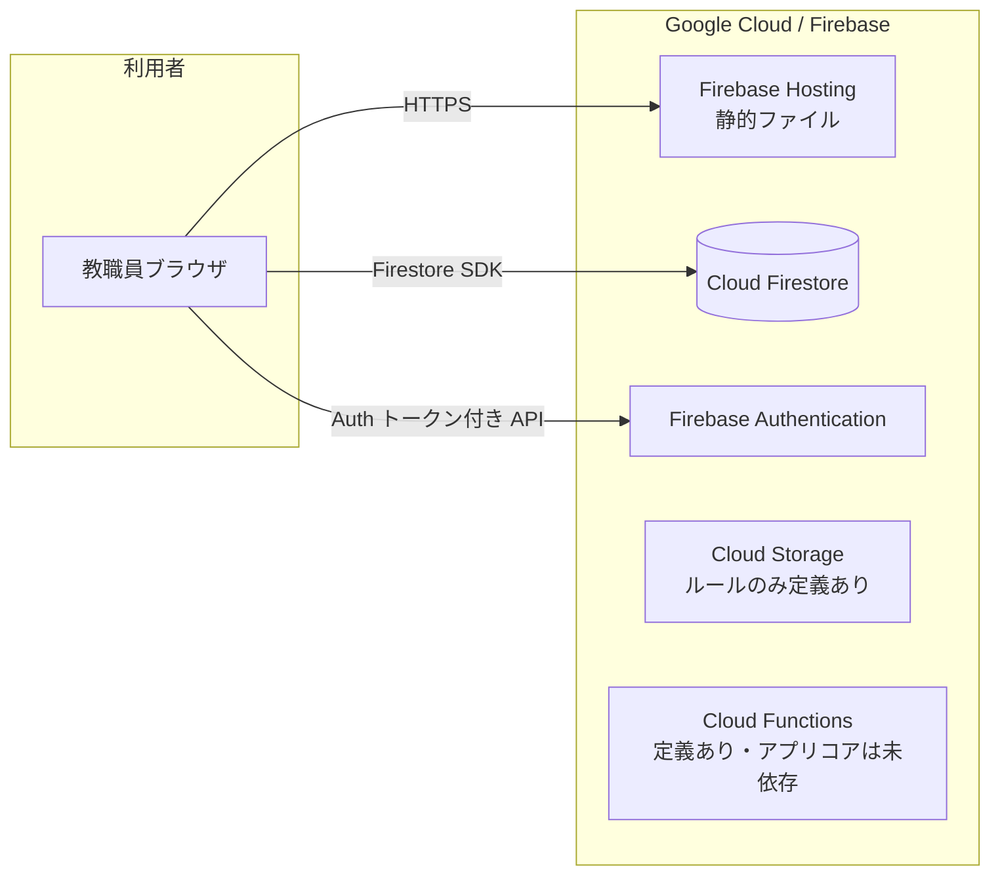
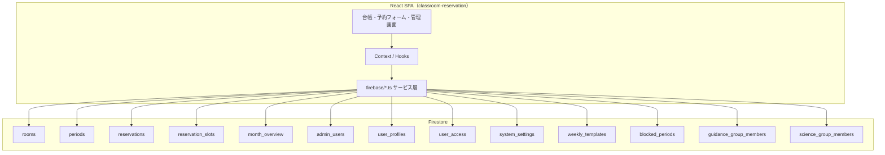
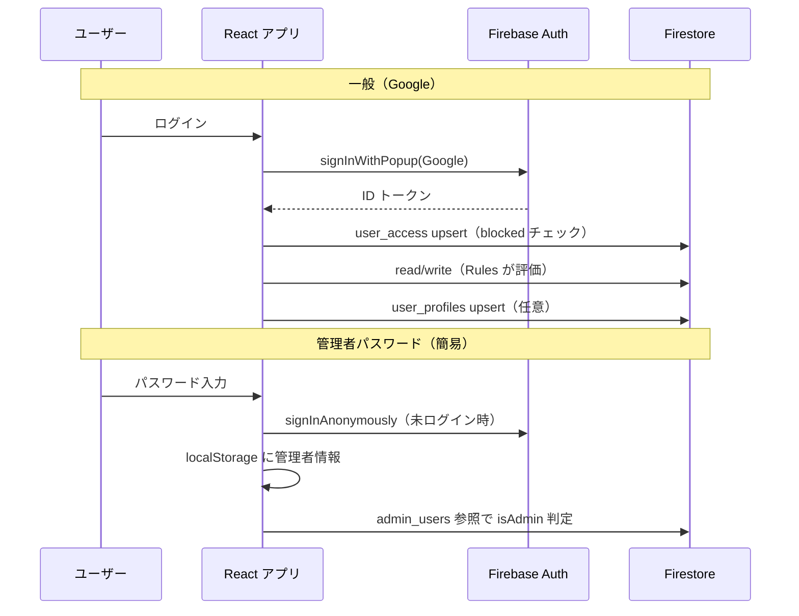

# 桜和高校 教室予約システム — 社内向け技術メモ・引き継ぎ資料（1枚）

> **用途**: 情報担当・開発引き継ぎ・問い合わせ時の技術概要確認  
> **対象リポジトリ**: `firebase-app/classroom-reservation`（フロント）＋ Firebase プロジェクト（本番例: `owa-cbs`）  
> **注意**: アプリ表示バージョン（`src/version.ts`）と `package.json` の `"version"` は運用でずれることがあるため、リリース時は揃えることを推奨。

---

## 1. システム概要（何で動いているか）

| 区分 | 技術 |
|------|------|
| **利用形態** | ブラウザで利用する **SPA**（シングルページアプリ） |
| **フロント** | **React 18** + **TypeScript** + **Create React App**（`react-scripts` 5.x） |
| **BaaS** | **Google Firebase**（**Hosting** + **Firestore** + **Authentication**） |
| **主要SDK** | **Firebase JavaScript SDK v9**（モジュラーAPI） |
| **通知UI** | **react-hot-toast** |

バックエンド専用サーバ（自前API）は置かず、**クライアントが Firestore に直接接続**する構成です。予約の整合性（スロット占有など）は **Firestore トランザクション／バッチ** と **Security Rules** で担保しています。

---

## 2. 構成図（Mermaid）

以下は **GitHub / GitLab** や **Notion（Mermaid対応）**、**VS Code プレビュー** 等で表示できます。

### 2.1 全体アーキテクチャ

### 2.2 アプリ ↔ Firestore（論理）

### 2.3 認証フロー（概要）

---

## 3. 技術スタック一覧（短縮版）

| レイヤ | 内容 |
|--------|------|
| 言語 | TypeScript 4.9 |
| UI | React 18、CSS（コンポーネント単位） |
| データ | Firestore（リージョン: `asia-east1`） |
| 認証 | Firebase Auth（Google / 匿名） |
| ホスティング | Firebase Hosting（`build` → 配信、SPA rewrite） |
| ビルド | `npm run build`（本番用静的ファイル） |
| デプロイ | Firebase CLI `firebase deploy`（例: `hosting`, `firestore:rules`） |
| 検証用URL | Hosting **プレビューチャンネル**（本番と別URL） |

---

## 4. Firestore コレクション一覧表

> **備考**: 実際のフィールドは `src/firebase/*.ts` や `types/common.ts` を参照。下表は **役割と Rules 上のポイント** に絞っています。

| コレクション | 主な用途 | 代表データのイメージ | Security Rules（概要） |
|--------------|----------|----------------------|-------------------------|
| **`rooms`** | 教室マスタ | 名称・説明・`scienceGroupOnly` 等（定員フィールドは使用しない） | **認証済み read**（一覧クエリ整合のため緩和）。理科の非表示は主にクライアント※ |
| **`periods`** | 時限マスタ（未使用に近い場合あり） | 時限定義 | 読み取り公開 / 認証で write |
| **`reservations`** | 予約本体 | roomId, 日時, period, title, createdBy, roomName など | **認証済み read**。**create** は本人（`createdBy == uid`）。update/delete は従来の条件あり※ |
| **`reservation_slots`** | 同時予約防止用の占有スロット | room×日×時限 などのID | **認証済み read/write**（トランザクション・未作成 doc 対応のため緩和）※ |
| **`month_overview`** | 月次集計（削除処理等との整合） | 月IDごとのカウンタ等 | read 公開 / 認証で write |
| **`admin_users`** | 管理者フラグ | uid または email キー、tier 等 | 認証ユーザ read / admin のみ write |
| **`user_profiles`** | UID↔メール等（管理者追加の逆引き） | uid, email, displayName | 認証 read / 本人 write |
| **`user_access`** | ユーザーアクセス管理（一覧・ブロック制御） | uid, email, displayName, status(allowed/blocked), firstSeenAt, lastSeenAt | 認証 read / 本人+admin write / admin delete |
| **`system_settings`** | グローバル設定 | `global` ドキュメント: 予約上限日、曜日ルール、**会議室削除パスコード** 等 | read 公開（UI用） / admin のみ write |
| **`weekly_templates`** | 週次固定予約テンプレ | 管理者が定義 | read 公開 / admin のみ write |
| **`blocked_periods`** | 予約禁止期間 | 期間・教室（複数可）・時限（複数可）・理由 | read 公開 / admin のみ write |
| **`guidance_group_members`** | 進路特例メンバー（先日付免除の対象者） | ドキュメントID=UID、`active` 等 | 本人+admin read / admin のみ write |
| **`science_group_members`** | 理科グループ（実験室の閲覧・予約対象者） | ドキュメントID=UID、`active` 等 | 本人+admin read / admin のみ write |

### ※ `reservations` の delete 条件（重要）

- **作成者本人**、または **管理者（`admin_users`）**、または **`roomName == '会議室'`** のドキュメントは **認証ユーザーが delete 可能**  
- **会議室のパスコード認証はアプリ側のみ**。ルール単体ではパスコードは検証できない（学校運用向けの割り切り）

### ※ 進路・理科の特例（要約）

- **進路**: `guidance_privilege` で会議室 `roomId` を指定し、`guidance_group_members` の有効メンバーがその教室のみ先日付免除（**ルール上の先日付強制は 2026-04 時点で reservations create から外している**。運用は管理画面・UI）。
- **理科**: 台帳・教室一覧では **`filterScienceOnlyRoomsForViewer` 等で UI から除外**。Firestore ルールは **一覧・作成で詰まらないよう認証ベースに緩和**しているため、**厳密な秘匿はクライアント＋運用前提**（詳細は `HANDOVER_2026-04-15_ledger-firestore-rules.md`）。

---

## 5. デプロイ・運用コマンド（参照）

| 作業 | コマンド例 |
|------|------------|
| ローカル開発 | `cd firebase-app/classroom-reservation && npm start` |
| 本番ビルド | `npm run build` |
| 本番反映 | `cd firebase-app && firebase deploy --only hosting,firestore:rules` |
| プレビュー | `firebase hosting:channel:deploy <チャネル名> --expires 7d` |

Firebase プロジェクトの選択は **`.firebaserc`** / `firebase use` で確認。

---

## 6. 設定・環境変数（開発時）

Firebase 初期化は `src/firebase/config.ts` で行い、原則：

- **`REACT_APP_FIREBASE_*`** 環境変数、または
- Hosting 上の **`/__/firebase/init.json`**（フォールバック）

本番 Firebase の API キー等は **リポジトリに直書きしない**運用を推奨。

---

## 6.5. 管理画面の権限（管理者 vs スーパー管理者）

`admin_users` に登録されたユーザーはフロントでは **`isAdmin`**（管理者）として扱う。  
さらに Firestore の `tier` や所定メール等で **`isSuperAdmin`**（スーパー管理者）を判定する（`src/firebase/admin.ts`）。

| 区分 | 管理画面で**操作できる**設定 |
|------|------------------------------|
| **管理者（Admin）** | **予約制限**（`system_settings` の予約最終日） **会議室削除パスコード**（同上） **予約禁止期間**（`blocked_periods`） |
| **スーパー管理者（Super Admin）** | 上記の **すべて** に加え、 **固定予約テンプレート**（`weekly_templates`、テンプレ適用・CSV・一括削除を含む） **ユーザー管理**（`user_access` / `admin_users` への操作など） |

**UI の挙動（`AdminPage.tsx`）**

- 左ナビは **全項目を表示**。スーパー専用の 2 項目は、一般管理者には **グレーアウト＋disabled**（ツールチップで「スーパー管理者のみ」）。
- 予約画面ヘッダーの「管理・設定」リンクは **ログイン済みかつ管理者かつ認証判定完了後**のみ表示（一般ユーザー・未ログインでは非表示）。

**Firestore Rules との差（補足）**

- `weekly_templates` の **write** は Rules 上は **`isAdmin()`** でも可。ただし **アプリは当該ペインをスーパーのみが開ける**ようにしており、通常管理者はテンプレート機能にアクセスできない（運用は UI 前提）。

---

## 7. 関連ファイル（変更時の起点）

| 内容 | パス例 |
|------|--------|
| Firestore Rules | `firebase-app/firestore.rules` |
| Hosting 設定 | `firebase-app/firebase.json` |
| 予約・スロット実装 | `classroom-reservation/src/firebase/firestore.ts` |
| 引き継ぎ（2026-04 台帳・ルール対応の記録） | `firebase-app/docs/HANDOVER_2026-04-15_ledger-firestore-rules.md` |
| 認証 | `classroom-reservation/src/firebase/auth.ts` |
| 管理者 | `classroom-reservation/src/firebase/admin.ts` |
| ユーザーアクセス管理 | `classroom-reservation/src/firebase/userAccess.ts` |
| ユーザー管理画面 | `classroom-reservation/src/components/admin/UserAccessManager.tsx` |
| 管理・設定ページ（左ナビ） | `classroom-reservation/src/components/AdminPage.tsx` / `AdminPage.css`（`/admin?section=`） |
| システム設定 | `classroom-reservation/src/firebase/settings.ts` |
| 予約禁止期間サービス | `classroom-reservation/src/firebase/blockedPeriods.ts` |
| 禁止期間管理画面 | `classroom-reservation/src/components/admin/BlockedPeriodsSettings.tsx` |

---

## 8. 改訂履歴（このドキュメント）

| 日付 | バージョン | 内容 |
|------|-----------|------|
| 2026-01-26 | v2.7.0 | 初版作成（技術メモ・Mermaid・コレクション一覧） |
| 2026-03-20 | v2.8.0 | ユーザーアクセス管理機能を追加。`user_access` コレクション新設、管理者画面で全ログインユーザーの一覧表示・ブロック/許可切替・Admin権限付与/解除・ユーザー削除が可能に。`user_profiles` からの過去ユーザー自動同期機能。Firebase Auth トークン遅延対応（admin チェックのリトライロジック追加）。旧「管理者権限管理」画面を廃止し「ユーザー管理」に統合。 |
| 2026-01-21 | v2.9.3 | 管理画面のスタイル整理：`admin-settings-blocks.css` に予約制限・パスコード・禁止期間のブロックを集約（`admin-card`+`rls-*` の二重クラスを廃止）。`AdminPage` は `AdminUserManager.css` に依存しない。スーパー管理者セクションのユーザー管理ラッパー div を削除。 |
| 2026-01-21 | v2.9.4 | UI統一の第1段：`PasscodeSettings` と `BlockedPeriodsSettings` の inline style を `admin-settings-blocks.css` の共通クラスへ移行。管理画面のボタン/入力/注意表示の色と余白をトークン準拠に統一。`MainApp.css` の `.toggle-panel-button` 重複定義を解消。 |
| 2026-01-21 | v2.9.5 | 管理画面の再設計：固定予約テンプレート機能をモーダルから管理ページ内へ常設化（`RecurringTemplatesWorkspace` 新設）。テンプレート管理・期間適用・CSV一括予約・期間削除を同一画面で整理。配色は既存トークンへ寄せ、色数を増やさずに統一。 |
| 2026-03-21 | v2.9.6 | 管理・設定を **左ナビ（項目一覧）＋右ペイン（選択内容）** に変更。`?section=` クエリで表示項目を同期（ブックマーク・共有可）。スーパー管理者のみ「固定予約テンプレート」「ユーザー管理」を表示。 |
| 2026-03-21 | v2.9.7 | 予約画面ヘッダーの「管理・設定」は **ログイン済み管理者かつ認証判定完了後**のみ表示。管理画面左ナビは **全項目を常に表示**し、スーパー専用項目は一般管理者向けに **グレーアウト＋disabled**（ツールチップで理由表示）。 |
| 2026-03-21 | v2.9.7 追記 | ドキュメント **§6.5** に「管理者 vs スーパー管理者」の設定可能範囲を整理。 |
| 2026-03-21 | v2.10.0 | 予約禁止期間設定を拡張。教室・時限ともに複数選択可能（トグルボタン UI）。BlockedPeriod に roomIds / roomNames / periods フィールドを追加。旧データ（単一 roomId）との後方互換性を維持。予約フォームの禁止チェックに時限情報を連携。 |
| 2026-04-15 | — | 一般ユーザー台帳・予約まわり：`rooms` / `reservations` / `reservation_slots` の Security Rules を認証ベースに整理（一覧クエリ・トランザクション・作成失敗の解消）。`getAllRooms` 等の `id` マッピング修正（`...data` 後に `id: docSnap.id`）。詳細は `HANDOVER_2026-04-15_ledger-firestore-rules.md`。 |

---

*End of document*
